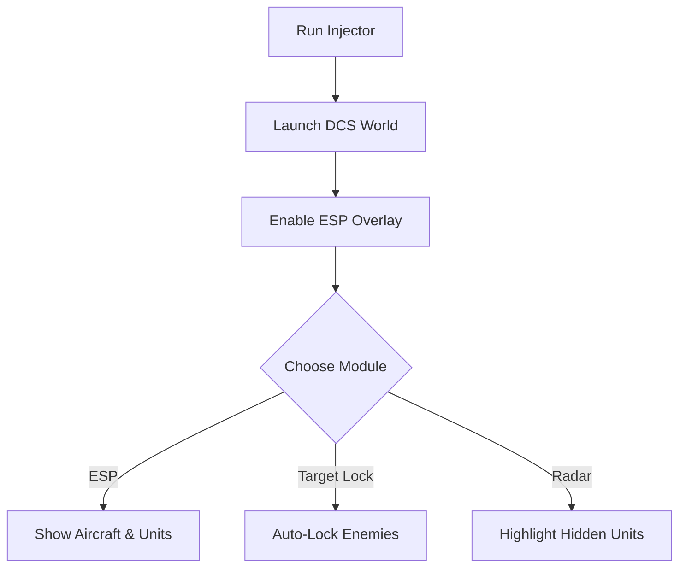

# DCS World Cheat ✈️

The **DCS World Cheat Software** is crafted for players who want deeper insight and flexibility in one of the most detailed flight simulators available. With ESP overlays, targeting modules, and customizable configs, it provides powerful tools for testing, training, and experimenting.

---

## 📝 Overview

DCS World is renowned for its realism, but sometimes you need a **training edge**. This cheat tool helps you refine tactics by showing hidden data, automating certain functions, and highlighting targets. Ideal for pilots looking to **analyze combat scenarios**, **practice maneuvers**, or **test system responses**.

\[!WARNING]
This software is intended for **testing and training environments only**. Use responsibly and keep backups of your configs.

[](#)
[](#)
[](#)
[](#)

---

## ⭐ Features

* **ESP Overlay** – Identify aircraft, ground units, and missile paths.
* **Target Lock Module** – Smooth auto-lock with adjustable FOV.
* **Radar Highlights** – Visualize hidden units for awareness.
* **Configurable Hotkeys** – Toggle functions instantly in-flight.
* **Performance Overlay** – Monitor FPS, latency, and module load.
* **Custom Profiles** – Save loadouts for training missions.

---

## 🖥 Compatibility

| Platform       | Supported | Notes                           |
| -------------- | --------- | ------------------------------- |
| Windows 10/11  | ✅         | Fully supported                 |
| Steam          | ✅         | Stable with overlay             |
| VR Mode        | ⚠️        | ESP overlay may need adjustment |
| Linux (Proton) | ⚠️        | Limited functionality           |
| macOS          | ❌         | Not supported                   |

\[!NOTE]
Accessibility: ESP colors and text sizes can be configured to work with VR and ultra-wide monitors.

---

## ⚡ Setup Guide

1. **Download** the cheat package.
2. Extract files to your DCS World directory.
3. Run `Injector.exe` as administrator.
4. Launch DCS World and press `INSERT` to enable overlay.
5. Adjust settings in `config.ini` or directly in the in-game overlay.

```ini
[esp]
aircraft=yellow
ground=green
missiles=red

[target_lock]
fov=65
smooth=5
hotkey=VK_RBUTTON
```

---

## 🔄 Workflow Diagram



---

## ❓ FAQ

**Q: Does this affect multiplayer servers?**
A: It is intended for **single-player and private training** only.

**Q: Can I use it with VR?**
A: Yes, but overlay scaling may require adjustment.

**Q: Will it slow down performance?**
A: Minimal impact; modules are optimized for real-time simulation.

**Q: Are hotkeys customizable?**
A: Yes, all functions can be rebound in the config file.

**Q: Does it alter save data?**
A: No, it works only in runtime memory.

---

## 🚀 Final Thoughts

The **DCS World Cheat Software** enhances training by combining **ESP overlays**, **target modules**, and **custom profiles**. Perfect for refining combat tactics, testing builds, and analyzing scenarios in one of the most realistic simulators.


---
